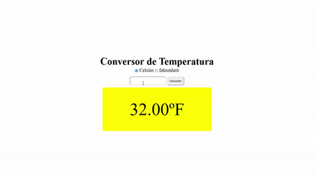
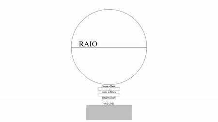
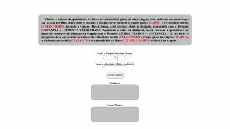
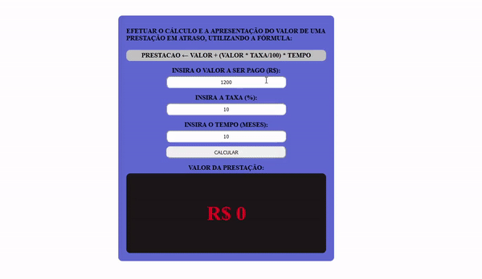
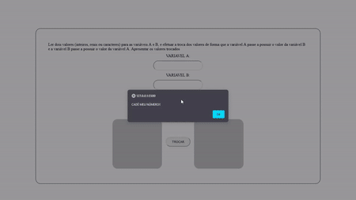
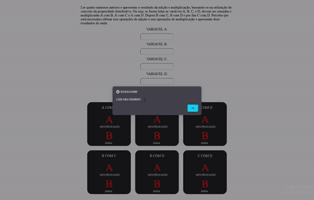
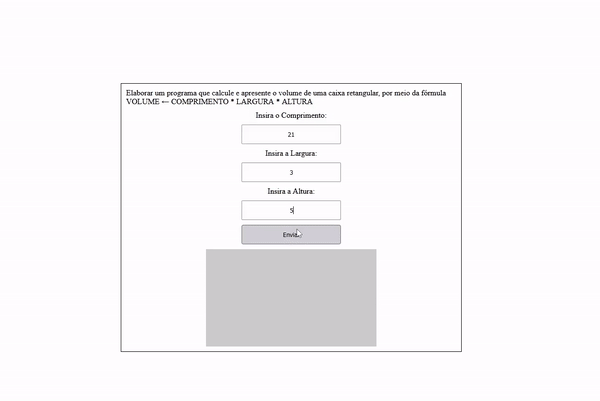
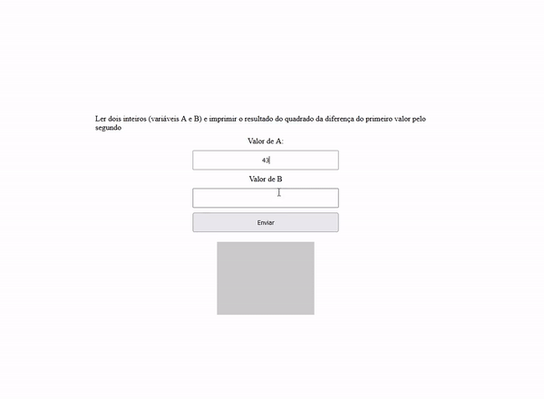
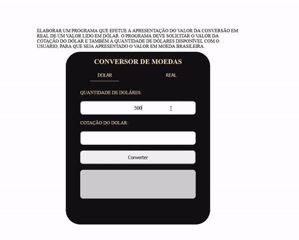
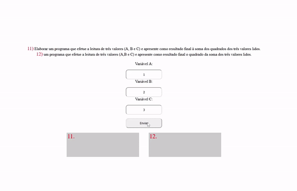

# Lista de Exercicios Manzano
## Exercicios do 1 ao 13

Nessa lista resolvi fazer diferente do que fiz com os exercicios de lógica em visual G, resolvi exercitar minha comunicação entre HTMl, CSS e JS criando formulários para que o usuário insira os valores e displays para mostrar os resultados obtidos.

Utilizei HTML, CSS e JS puros no Visual Estudio Code

## Exercício 01 e Exercício 02

1) Ler  uma  temperatura  em  graus  Celsius  e  apresentá-la  convertida  em  graus  Fahrenheit. 
    A  fórmula  de conversão é `F ← (9 * C + 160) / 5`, sendo F a temperatura em Fahrenheit e C a temperatura em Celsius.

2) Ler  uma  temperatura  em  graus  Fahrenheit  e  apresentá-la  convertida  em  graus  Celsius. 
    A  fórmula  de conversão é `C ← (F - 32) * (5/9)`, sendo F a temperatura em Fahrenheit e C a temperatura em Celsius.

## Exercicio 03

3) Calcular e apresentar o valor do volume de uma lata de óleo, utilizando a fórmula:  
    `Volume = raio² * pi * Alutura`

## Exercício 04

4) Efetuar  o  cálculo  da  quantidade  de  litros  de  combustível  gasta    em  uma  viagem,  utilizando  um automóvel  que  faz  12  Km  por  litro.  Para  obter  o  cálculo,  o  usuário  deve  fornecer  o  tempo  gasto `(TEMPO)` e a velocidade  média `(VELOCIDADE)` durante  a viagem. Desta forma, será possível obter a distância  percorrida  com  a  fórmula  DISTANCIA ←  TEMPO  *  VELOCIDADE.  Possuindo  o  valor  da distância,  basta  calcular  a  quantidade  de  litros  de  combustível  utilizada  na  viagem  com  a  fórmula `LITROS_USADOS ← DISTANCIA / 12`. Ao final, o programa deve apresentar os valores da velocidade média  `(VELOCIDADE)`,  tempo  gasto  na  viagem  `(TEMPO)`,  a  distancia  percorrida  `(DISTANCIA)`  e  a quantidade de litros `(LITROS_USADOS)` utilizada na viagem

   

## Exercício 05

5)  Efetuar o cálculo e a apresentação do valor de uma prestação em atraso, utilizando a fórmula:   `PRESTACAO = VALOR + ((VALOR * TAXA/100) * TEMPO)`

## Exercício 06

6) Ler dois valores (inteiros, reais ou caracteres) para as variáveis A e B, e efetuar a troca dos valores de forma que a variável A passe a possuir o valor da variável B e a variável B passe a possuir o valor da variável A. Apresentar os valores trocados

## Exercício 07

7) Ler  quatro  números  inteiros  e  apresentar  o  resultado  da  adição  e  multiplicação,  baseando-se  na utilização  do  conceito  da  propriedade  distributiva.  Ou  seja,  se  forem  lidas  as  variáveis  A,  B,  C,  e  D, devem ser somadas e multiplicadas A com B, A com C e A com D. Depois B com C, B com D e por fim C  com  D.  Perceba  que  será  necessário  efetuar  seis  operações  de  adição  e  seis  operações  de multiplicação e apresentar doze resultados de saída.

## Exercício 08

8) Elaborar um programa que calcule e apresente o volume de uma caixa retangular, por meio da fórmula 
    `VOLUME ← COMPRIMENTO * LARGURA * ALTURA`

## Exercício 09

9) Ler dois inteiros (variáveis A e B) e imprimir o resultado do quadrado da diferença do primeiro valor pelo segundo

## Exercício 10 e 11

10) Elaborar  um programa que efetue a apresentação do valor da conversão em real de um valor lido em dólar.  O  programa  deve  solicitar  o  valor  da  cotação  do  dólar  e  também  a  quantidade  de  dólares disponível com o usuário, para que seja apresentado o valor em moeda brasileira
11) Elaborar um programa que efetue a apresentação do valor da conversão em dólar de um valor lido em real. O programa deve solicitar o valor da cotação do dólar e também a quantidade de reais disponível com o usuário, para que seja apresentado o valor em moeda americana

## Exercício 12 e 13

12) Elaborar um programa que efetue a leitura de três valores (A, B e C) e apresente como resultado final à soma dos quadrados dos três valores lidos
13)  Elaborar um programa que efetue a leitura de três valores (A,B e C) e apresente como resultado final o quadrado da soma dos três valores lidos

